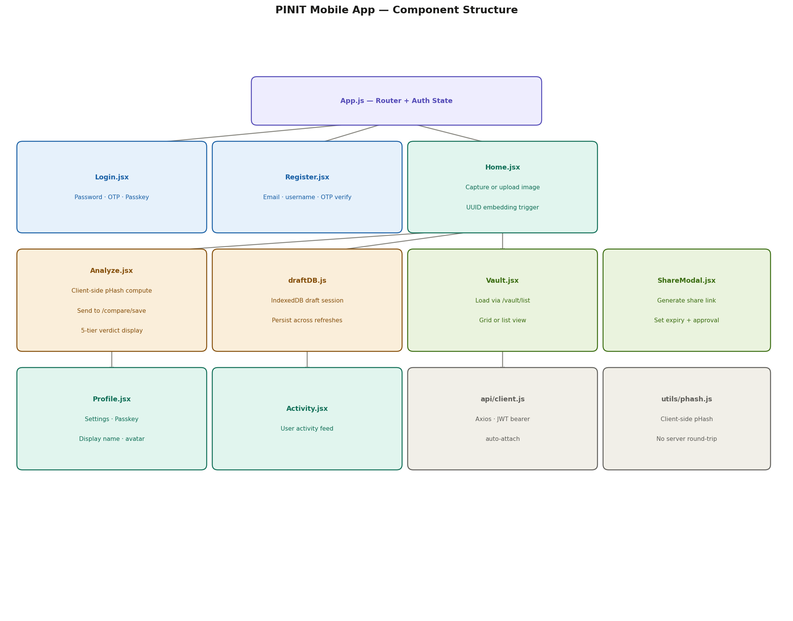

<div align="center">


# PINIT — Mobile App

[](https://react.dev)
[](https://capacitorjs.com)
[](https://developer.android.com)
[](https://pinit-mobile.vercel.app)

**[Live PWA](https://pinit-mobile.vercel.app)** | **[API Docs](https://pinit-backend.onrender.com/docs)** | **[Backend Repo](https://github.com/mannevi/pinit-backend)** | **[Admin Panel Repo](https://github.com/mannevi/image-crypto-analyzer)**

</div>

---

PINIT is an **image forensics and ownership verification platform**. It embeds a unique UUID invisibly into every pixel of an image at the point of capture — creating a tamper-evident cryptographic fingerprint that proves both **authenticity and ownership**.

This repository contains the **user-facing PINIT Mobile App** — built with React and Capacitor, distributed as an Android APK and accessible as a Progressive Web App.

| Platform | Distribution |
|---|---|
| Progressive Web App (PWA) | https://pinit-mobile.vercel.app |
| Android | Distributed as APK |
| Backend API | https://pinit-backend.onrender.com |

---

## 📰 News

- 🚩 **[2026.04]** Mobile App demonstrated to enterprise clients — APK and PWA both live and stable.
- 🚩 **[2026.03]** Mobile App fully extracted into its own dedicated repository with clean separation from the admin codebase.
- 🚩 **[2026.02]** Share links, biometric login (WebAuthn passkey), and vault features deployed.
- 🚩 **[2026.01]** Initial combined platform launched — Mobile App and Admin Panel sharing a single codebase.

---

## 📜 Introduction

PINIT gives users a simple, powerful way to certify their images and detect tampering. The app is built mobile-first and runs natively on Android via Capacitor — the same codebase also deploys as a PWA.

The platform works in two stages:

1. **Image certification** — the user captures or uploads an image. A UUID is embedded client-side and a pHash is computed before upload. The thumbnail is stored in Cloudinary; the vault record and certificate are saved to Supabase.

2. **Forensic comparison** — when authenticity is questioned, the user uploads a suspect image. The backend runs a multi-algorithm pipeline — SHA-256 exact match, UUID-based vault lookup, pHash Hamming distance, and histogram Bhattacharyya distance — returning a 5-tier verdict with a calibrated confidence score and public report link.

---

## 🏗️ Architecture


The Mobile App is **React + Capacitor**. `App.js` is the root router. All user screens live under `apps/mobile/`. The shared `api/client.js` is the single Axios instance. `phash.js` runs perceptual hashing entirely client-side before any network request is made.

---

## 🧩 Component Structure



## 🗂️ Project Structure

```
pinit-mobile/
│
├── android/                               # 📱 Native Android project (Capacitor)
│   └── app/src/main/java/com/pinit/app/
│       ├── MainActivity.java              # 🚀 Capacitor WebView entry point
│       └── BiometricPlugin.java           # 🔐 Custom native biometric auth plugin
│
├── src/
│   ├── App.js                             # 🗺️ Root router and auth state management
│   │
│   ├── api/
│   │   └── client.js                      # 🔌 Single Axios instance for all API calls
│   │
│   ├── apps/mobile/                       # 📲 All user-facing screens
│   │   ├── auth/
│   │   │   ├── Login.jsx                  # 🔑 Login — password, OTP, or passkey
│   │   │   └── Register.jsx               # 📝 Registration with OTP verification
│   │   │
│   │   ├── home/
│   │   │   └── Home.jsx                   # 🏠 Home — capture or upload image
│   │   │
│   │   ├── analyze/
│   │   │   ├── Analyze.jsx                # 🔬 Forensic analysis and comparison flow
│   │   │   └── utils/draftDB.js           # 💾 IndexedDB draft session management
│   │   │
│   │   ├── vault/
│   │   │   ├── Vault.jsx                  # 🗄️ Personal certified image vault
│   │   │   ├── components/
│   │   │   │   ├── VaultList.jsx          # 📋 Asset grid and list view
│   │   │   │   ├── VaultItem.jsx          # 🖼️ Individual asset thumbnail card
│   │   │   │   ├── VaultDetail.jsx        # 🔍 Full asset view with metadata
│   │   │   │   └── ShareModal.jsx         # 🔗 Share link generation UI
│   │   │   └── utils/
│   │   │       ├── vaultStorage.js        # 💽 IndexedDB vault cache layer
│   │   │       ├── vaultImageCache.js     # 🖼️ Image blob caching
│   │   │       └── shareLinkUtils.js      # 🔗 Share token helpers
│   │   │
│   │   ├── activity/
│   │   │   └── Activity.jsx               # 📋 User activity feed
│   │   │
│   │   └── profile/
│   │       ├── Profile.jsx                # 👤 Profile, settings, passkey management
│   │       └── ContactSupport.jsx         # 💬 In-app support form
│   │
│   └── utils/
│       ├── auth.js                        # 🔒 Token and session helpers
│       └── phash.js                       # 🧮 Client-side perceptual hash — runs fully in-browser
│
├── capacitor.config.ts                    # ⚙️ Capacitor project configuration
├── .env.example                           # 🔐 Environment variable reference
└── package.json                           # 📦 Dependencies
```

---

## ✨ Features

### 🔏 UUID Embedding and Image Certification
Users capture or upload an image. PINIT embeds a unique UUID invisibly into the image pixels, binding it cryptographically to the user's identity. A pHash is computed client-side, the thumbnail is uploaded to Cloudinary, and the vault record with full metadata is saved to Supabase.

### 🔬 Forensic Analysis and Comparison
Users upload a suspect image to compare against the certified original. The backend runs a multi-algorithm pipeline:

| Algorithm | Method |
|---|---|
| Exact match | SHA-256 hash comparison |
| Identity lookup | UUID-based vault record match |
| Perceptual match | pHash Hamming distance (0–100%) |
| Colour match | Histogram Bhattacharyya distance |

Returns a 5-tier verdict:

| Verdict | Meaning |
|---|---|
| `EXACT MATCH` | Image is unmodified — pixel-perfect match |
| `STRONG MATCH` | Minor compression artefacts only — no tampering |
| `PARTIAL MATCH` | Detectable edits — possible cropping or adjustments |
| `WEAK SIMILARITY` | Significant differences — likely tampered |
| `NO MATCH` | Images are unrelated or heavily altered |

### 🗄️ Personal Vault
A private vault stores all of a user's certified image assets with complete metadata — file hash, visual fingerprint, resolution, file size, capture timestamp, and device ID. Each entry can be shared externally via a generated public link.

### 🔗 Share Links
Users generate time-limited public share links for any vaulted asset. Recipients can view and request a download. The owner approves or denies — all events are tracked in the share audit log.

### 🔐 Multi-Method Authentication
Three supported login flows:
- **Email + Password** with OTP email verification
- **WebAuthn Passkey** — biometric or device authenticator (fingerprint, Face ID)

### 📋 Activity Feed
Chronological log of all forensic analyses and comparison events performed by the user.

---

## 🚀 Getting Started

### Prerequisites

- Node.js 18+
- Android Studio *(only required for APK builds)*
- PINIT backend running locally or use the hosted API at `https://pinit-backend.onrender.com`

### Installation

1. Clone the repository

```sh
git clone https://github.com/mannevi/pinit-mobile.git
cd pinit-mobile
```

2. Install dependencies

```sh
npm install
```

3. Configure environment variables

```sh
cp .env.example .env
# Set REACT_APP_API_URL in .env
```

4. Start the development server

```sh
npm start
```

App runs at `http://localhost:3000`.

---

## 📱 Android APK Build

1. Build the React production bundle

```sh
npm run build
```

2. Sync the web build into the Capacitor Android project

```sh
npx cap sync android
```

3. Open in Android Studio

```sh
npx cap open android
```

4. In Android Studio — **Build → Build Bundle(s) / APK(s) → Build APK(s)**

Output: `android/app/build/outputs/apk/debug/`

---

## ⚙️ Environment Variables

| Variable | Description |
|---|---|
| `REACT_APP_API_URL` | PINIT backend base URL |

> In production, environment variables are configured in the Vercel project dashboard — not via a committed `.env` file.

---

## 🔗 Related Repositories

| Repository | Description | URL |
|---|---|---|
| [pinit-backend](https://github.com/mannevi/pinit-backend) | Shared FastAPI backend — serves both admin and mobile | https://pinit-backend.onrender.com |
| [pinit-admin](https://github.com/mannevi/image-crypto-analyzer) | Admin Web Panel (React) | https://image-crypto-analyzer.vercel.app |

---

© 2026 PINIT. All rights reserved.
